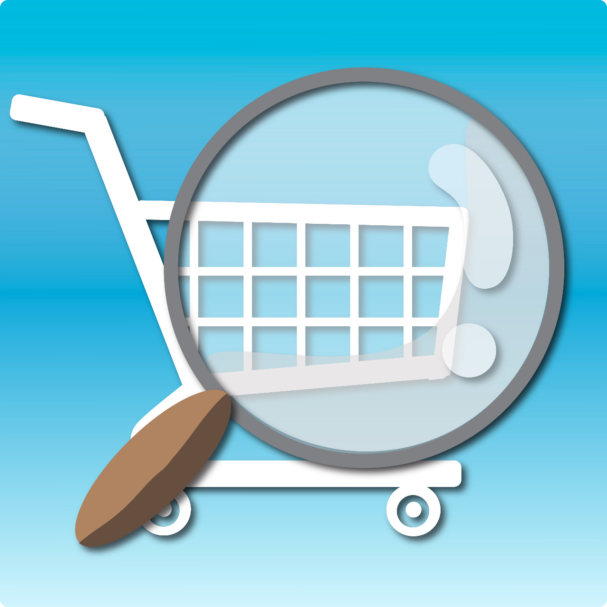

# FindMyProduct

# FindMyProduct

 

FindMyProduct is a new mobile app, where it can be possible to detect objects in real time, helping people with shopping of groceries and supermarket products, it has some characteristics like recognizing objects with the phone camera.

## License

The code is distributed under the [GPLv3 License](LICENSE.md)  
All files in `assets/` are distributed under the [CC BY-SA 4.0 License](./assets/LICENSE.md)
